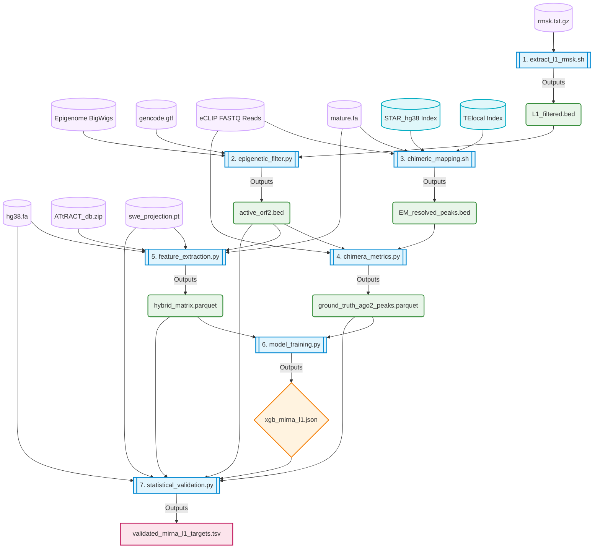

```mermaid
flowchart TD
    classDef rawData fill:#f9f0ff,stroke:#d2a8ff,stroke-width:2px;
    classDef indices fill:#e0f7fa,stroke:#00acc1,stroke-width:2px;
    classDef script fill:#e1f5fe,stroke:#0288d1,stroke-width:2px;
    classDef preppedData fill:#e8f5e9,stroke:#388e3c,stroke-width:2px;
    classDef model fill:#fff3e0,stroke:#f57c00,stroke-width:2px;
    classDef finalResult fill:#fce4ec,stroke:#c2185b,stroke-width:2px;

    %% Raw Data
    RMSK[(rmsk.txt.gz)]:::rawData
    BWS[(Epigenome BigWigs)]:::rawData
    GTF[(gencode.gtf)]:::rawData
    FASTQ[(eCLIP FASTQ Reads)]:::rawData
    MATURE[(mature.fa)]:::rawData
    HG38[(hg38.fa)]:::rawData
    ATTRACT[(ATtRACT_db.zip)]:::rawData
    PROJ[(swe_projection.pt)]:::rawData
    
    %% Indices (Derived from Genome)
    STAR_IDX[(STAR_hg38 Index)]:::indices
    TE_IDX[(TElocal Index)]:::indices

    %% Scripts
    S1[[1. extract_l1_rmsk.sh]]:::script
    S2[[2. epigenetic_filter.py]]:::script
    S3[[3. chimeric_mapping.sh]]:::script
    S4[[4. chimera_metrics.py]]:::script
    S5[[5. feature_extraction.py]]:::script
    S6[[6. model_training.py]]:::script
    S7[[7. statistical_validation.py]]:::script

    %% Intermediate Artifacts
    BED_FILTERED(L1_filtered.bed):::preppedData
    BED_ACTIVE(active_orf2.bed):::preppedData
    BED_PEAKS(EM_resolved_peaks.bed):::preppedData
    PARQUET_PEAKS(ground_truth_ago2_peaks.parquet):::preppedData
    PARQUET_FEATS(hybrid_matrix.parquet):::preppedData
    JSON_MODEL{xgb_mirna_l1.json}:::model

    %% Final Outputs
    TSV_VAL[validated_mirna_l1_targets.tsv]:::finalResult

    %% Flow: Step 1
    RMSK --> S1
    S1 -->|Outputs| BED_FILTERED
    
    %% Flow: Step 2
    BED_FILTERED --> S2
    BWS --> S2
    GTF --> S2
    S2 -->|Outputs| BED_ACTIVE
    
    %% Flow: Step 3
    FASTQ --> S3
    MATURE --> S3
    STAR_IDX --> S3
    TE_IDX --> S3
    S3 -->|Outputs| BED_PEAKS
    
    %% Flow: Step 4
    BED_PEAKS --> S4
    BED_ACTIVE --> S4
    FASTQ --> S4
    S4 -->|Outputs| PARQUET_PEAKS

    %% Flow: Step 5
    BED_ACTIVE --> S5
    HG38 --> S5
    MATURE --> S5
    ATTRACT --> S5
    PROJ --> S5
    S5 -->|Outputs| PARQUET_FEATS

    %% Flow: Step 6 (Mapping Features to Labels)
    PARQUET_FEATS --> S6
    PARQUET_PEAKS --> S6
    S6 -->|Outputs| JSON_MODEL

    %% Flow: Step 7
    JSON_MODEL --> S7
    PARQUET_FEATS --> S7
    PARQUET_PEAKS --> S7
    BED_ACTIVE --> S7
    HG38 --> S7
    PROJ --> S7
    S7 -->|Outputs| TSV_VAL
```
